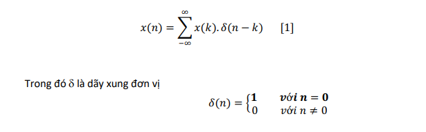
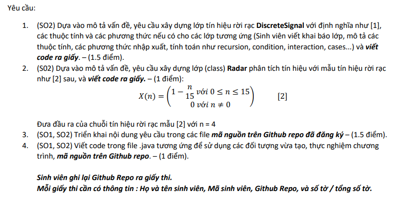

# INFO

## Câu 1. (CLO.1 – PI1.1, 1.2 – SO1): 3 điểm

> 1. Tạo một giao diện `(Interface)` tín hiệu có tên **Signal**
> 2. Tạo một lớp `(class)` tín hiệu rời rạc kế thừa tín hiệu Signal có tên **DiscreteSignal**
> 3. Tạo một lớp `(class)` tín hiệu liên tục kế thừa tín hiệu Signal có tên là **ContinuousSignal**

## Câu 2. (CLO.2,3 – PI1.1,1.2,2.1,2.2 - SO.1,2 ): 7 điểm

> Trong lớp tín hiệu rời rạc, Discrete Signal thực hiện `(“implementation”)` định nghĩa tín hiệu rời rạc như sau:

> Request:
> 