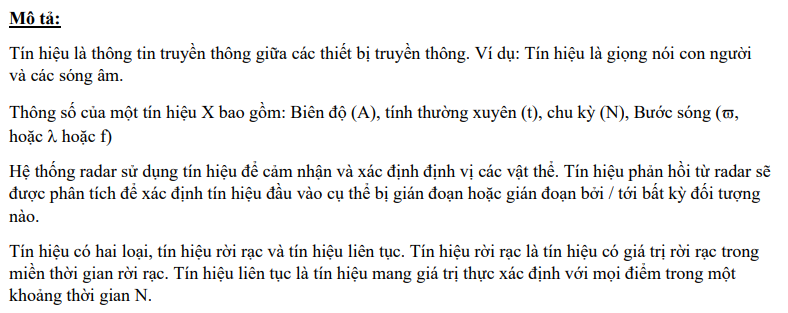
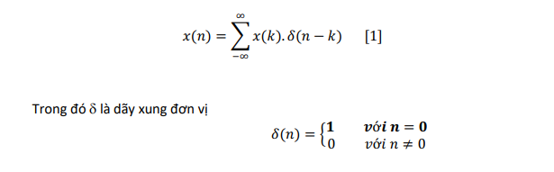
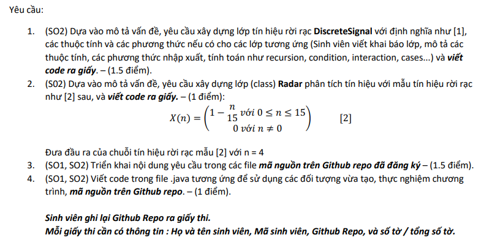
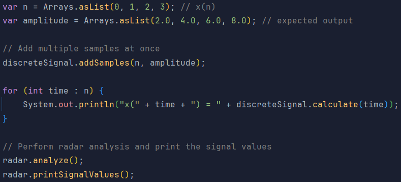
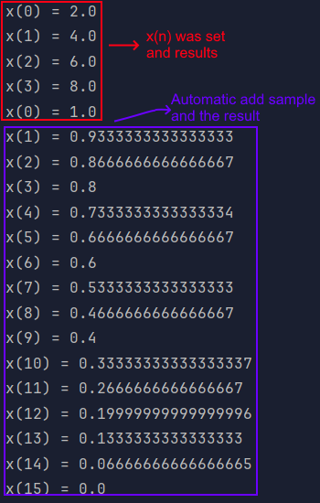

# INFO

## Câu 2. (CLO.2,3 – PI1.1,1.2,2.1,2.2 - SO.1,2 ): 7 điểm

> Trong lớp tín hiệu rời rạc, Discrete Signal thực hiện `(“implementation”)` định nghĩa tín hiệu rời rạc như sau:

### Request:
> 

### Experiment and expected results: 
> 
> Results:
> 